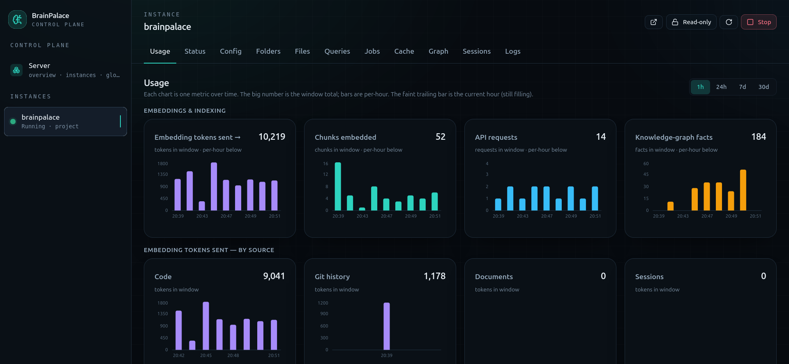
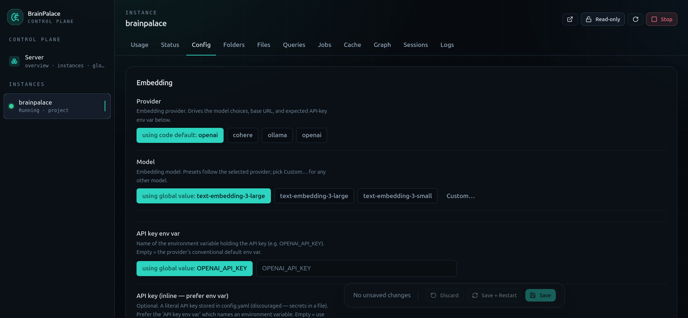
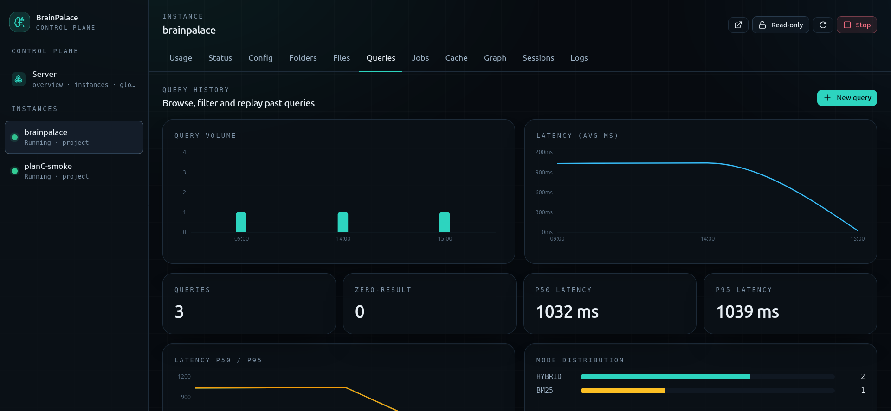
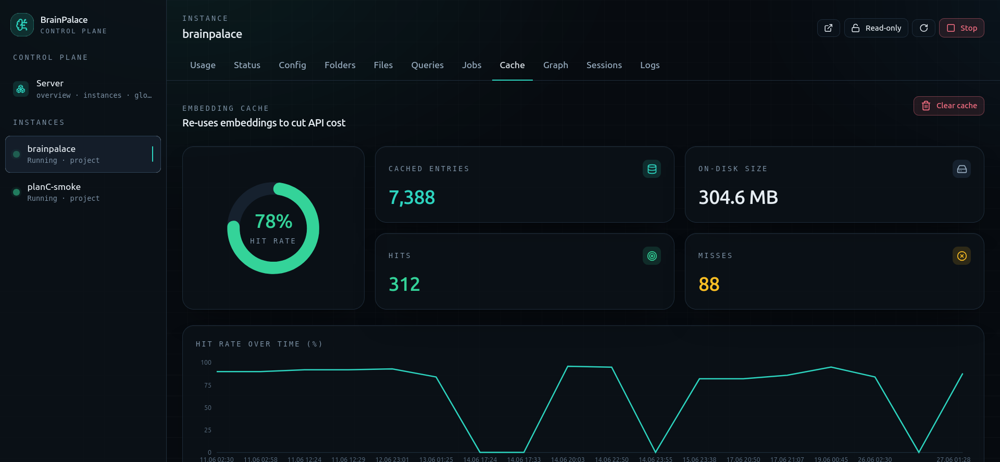
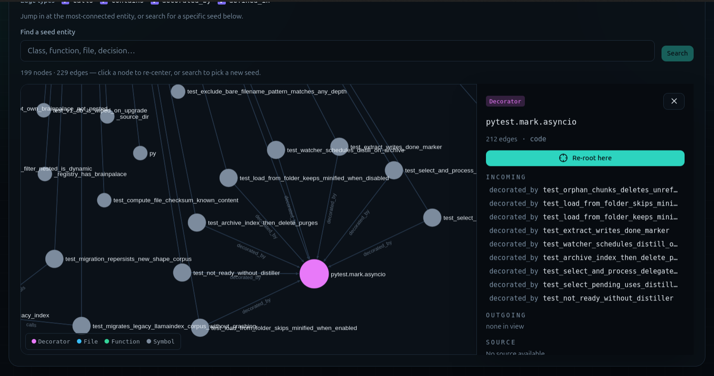

<div align="center">

[](docs/DASHBOARD.md)

<sub>One browser tab to manage every project server — instances · config · stats · jobs · cache · graph · sessions · logs · query history.</sub>


</div>

# BrainPalace

**Universal Vector + Graph RAG with a memory store.**

Built for :
- code & docs repos
- and for any text project like personal life or work memory projects with option to index content of external sources.

Talk to your code, docs, text files and for Claude Code, Codex and Antigravity CLI : also with chat session history.

Explore it with Vector, BM25, Hybrid, Temporal Graph, Multi, Compute, Scan, Absence, Timeline, and Salience modes.

For text memory like projects - you are free to organize folders and files as you like. Write facts and details into text files like you are explaning to someone. All text will be indexed and re-indexed on changes. Everything you write your LLM model will know when asked.

For code repos - never track which chat session you're in or where is one function or how one item is related to another and why. Stop one session today, come back in days — the memory is still there. Curate it hourly, daily, monthly, or just ask "what did we talk about last time?"

You can add folders outside of your repo. Also if you want to index some of your online sources, tell your LLM to build input source adapter for that specific source and explain how to handle new data, what to index and your LLM will use BrainPalace instruction how to create (to code) adapter. Build adapters for cloud drives, email, web. Keep files in folders, or ingest data straight into BrainPalace so the source can go away.

Push any text — source, image description, sensor data, YouTube or meeting transcripts, thoughts, ideas, your personal history. Any project works, not just code. Tell your LLM to read the BrainPalace instructions and push any folder in.

All will be indexed - re-indexed on file update - recalled instantly - with high accuracy and low or free local token cost.

Keep your memory always ready. Never forgotten. Upgrade your own personal memory with BrainPalace.

**Make The Context Window Unlimited**

|   |   |
|:-:|:-:|
| [](docs/images/dash-1-usage.png) | [](docs/images/dash-2-config.png) |

|   |   |
|:-:|:-:|
| [](docs/images/dash-3-queries.png) | [](docs/images/dash-4-cache.png) |

<a href="docs/images/dash-5-graph.png"></a>

## Install

**You'll need one embedding provider** — a cloud key (`OPENAI_API_KEY`,
`ANTHROPIC_API_KEY`, `COHERE_API_KEY`, `GEMINI_API_KEY`, or `XAI_API_KEY`) **or** a
local Ollama with an embedding model.

### Install — one line for all coding assistants

Open terminal and run:

```bash
curl -sSL https://raw.githubusercontent.com/bxw91/brainpalace/main/scripts/setup.sh | bash
```

It installs the `brainpalace` binary, configures a provider, and asks which AI
assistants to connect — skills runtimes (**Claude Code, Codex, OpenCode,
Antigravity, Qwen, Kimi, skill-runtime**) and MCP editors (**Cursor, Windsurf,
VS Code / Copilot, Kilo, Cline**).

---

### Init a project

Install once (above), then initialise each project you want indexed — the verb
depends on your assistant:

| Environment | Init a project |
|---|---|
| Claude Code | `/brainpalace-init` (also wires per-project MCP) |
| Codex / OpenCode / Antigravity / Qwen / Kimi | ask the assistant, or terminal `brainpalace init` |
| CLI / terminal | `brainpalace init` |

Project initialization wires Claude Code's MCP per project by default. Other runtimes and Windows / WSL2 notes: [`docs/INSTALL.md`](docs/INSTALL.md).

---

### Web dashboard

Manage every BrainPalace project server from one browser tab. 

On any BrainPalace instance start, dashboard is auto started. (requirement : Python 3.12+). To start manually:

```bash
brainpalace dashboard start
```

Full reference: [`docs/DASHBOARD.md`](docs/DASHBOARD.md).

---

## What is BrainPalace

BrainPalace indexes your codebase and documentation, then exposes the
resulting search over multiple interfaces so any AI assistant — or you
yourself — can answer questions against it. On top of plain retrieval it
keeps **persistent memory**: curated facts, captured coding-session summaries
and decisions, and a **temporal knowledge graph** that tracks how those
decisions supersede each other over time. Local-first by default (Ollama),
with optional cloud providers for embeddings and summarisation.

| Component | What it does |
|-----------|--------------|
| **Server** (`brainpalace-rag`) | FastAPI backend — indexing pipeline, BM25 + vector + GraphRAG stores, REST API |
| **CLI** (`brainpalace-cli`) | Click-based command-line client; primary interface for automation, mono-repos, and standalone use |
| **MCP server** (`brainpalace mcp`) | Opt-in stdio shim exposing typed tool calls. `brainpalace init`/`install-mcp` wire it into Claude Code per-project (`.mcp.json`); other clients (VS Code / Copilot, Cursor, Kilo Code, Cline, Continue, Zed) configure it by hand — see [MCP Setup](docs/MCP_SETUP.md) |
| **Claude Code plugin** | 43 slash commands, 6 agents, 2 skills for Claude Code users |
| **Web dashboard** (`brainpalace dashboard`) | Standalone browser control plane — manage every project server from one tab (instances, config, stats, jobs, cache, graph, sessions, logs, query history). Included with the CLI on Python 3.12+. See [DASHBOARD](docs/DASHBOARD.md) |

## Features

- **Web dashboard** — a standalone control plane that manages every BrainPalace
  project server from one browser tab: list/start/stop/restart instances, edit
  all config via forms, view stats, jobs, cache, graph, sessions, logs, and
  query history. Launch it with `brainpalace dashboard start` (port 8787;
  localhost-only, optional bearer token). See [DASHBOARD](docs/DASHBOARD.md).

- **Hybrid search** — BM25 keyword + semantic vector + GraphRAG, fused per query
  (`hybrid`, `multi`) or picked per call (`bm25`, `vector`, `graph`).
  See [Search Modes](#search-modes).

- **Compute query mode** — ask set-level questions over your sessions — totals,
  counts, and "which … the most" superlatives — instead of getting back
  documents (`--mode compute`). Session counts (files touched, tools used,
  decisions) are derived **free** from summaries, no extra API call.
  See [COMPUTE](docs/COMPUTE.md).

- **Multi-language search** — keyword search stays precise in non-English docs:
  per-language tokenizing across ~27 languages plus a Croatian stemmer, with a
  per-query `--language` override. See [Languages](#languages).

- **Session intelligence** — turns your AI-coding sessions into searchable
  memory: summaries, decisions, and a **typed knowledge graph** (Decision /
  Error / File / …), plus `remember`/`recall` curated notes that supersede stale
  decisions and keep the durable ones. Auto-captures Claude Code transcripts;
  other runtimes push via `/brainpalace-extract-session`. On by default for new
  projects (opt out with `init --no-sessions`).
  See [SESSION_INDEXING](docs/SESSION_INDEXING.md).

- **Session summarisation — free or near-free** — inside Claude Code the plugin
  summarises sessions on your subscription (Haiku, no separate API bill), or run
  it server-side on local Ollama (free + private). The server never summarises
  behind your back — no surprise cost — and `backfill-sessions` catches up old
  chats. See [SESSION_INDEXING](docs/SESSION_INDEXING.md).

- **GraphRAG** — entity + relationship extraction for dependency-aware queries:
  "what calls X", "modules importing Y", "classes extending Z".
  See [GRAPHRAG_GUIDE](docs/GRAPHRAG_GUIDE.md).

- **Persistent graph backend** — opt-in `store_type: sqlite` with **temporal
  validity** (per-edge validity windows, `invalidate`, `timeline`); scales past
  the in-memory default. See [GRAPHRAG_GUIDE](docs/GRAPHRAG_GUIDE.md).

- **LSP cross-references** (opt-in) — typed `calls`/`extends`/`implements`
  symbol graph from a real language server. See
  [LSP_INTEGRATION](docs/LSP_INTEGRATION.md).

- **Git-history indexing** — commit messages + diff stats as a searchable
  source, bridging *why* ↔ *what*. See [GIT_HISTORY](docs/GIT_HISTORY.md).

- **AST-aware code chunking** — tree-sitter for Python, TypeScript,
  JavaScript, Java, Go, Rust, C, C++, C#, Pascal.
  See [CODE_INDEXING](docs/CODE_INDEXING.md).

- **Time-decay ranking** — newer chunks rank higher (configurable half-life).
  See [CONFIGURATION](docs/CONFIGURATION.md).

- **Cross-encoder reranking** — opt-in two-stage retrieval for higher
  precision on the top-k. See [CONFIGURATION](docs/CONFIGURATION.md).

- **`.gitignore`-aware indexing + watching** — honours your project `.gitignore`
  (nested + negation), `.git/info/exclude`, your global excludes, and sensible
  built-in defaults (`node_modules`, `.venv`, `dist`, …).
  See [CODE_INDEXING](docs/CODE_INDEXING.md).

- **File watcher** — per-folder, debounced live re-index on change; `folders
  add` watches by default, disable with `--watch off`.
  See [USER_GUIDE](docs/USER_GUIDE.md).

- **Nested projects auto-excluded** — a subfolder with its own `.brainpalace/`
  is a separate project, so its subtree is skipped from the outer project (no
  double-indexing). Checked live. See [ARCHITECTURE](docs/ARCHITECTURE.md).

- **Multi-instance** — one server per project, automatic port allocation,
  `.brainpalace/runtime.json` discovery. Helpers: `whoami`, `status --all`,
  `stop --url`. See [ARCHITECTURE](docs/ARCHITECTURE.md).

- **URL auto-discovery** — CLI walks up from CWD to the owning server.
  Works correctly in mono-repos. See [ARCHITECTURE](docs/ARCHITECTURE.md).

- **Incremental indexing** — manifest + SHA-256; only changed files
  re-embed; chunk eviction tracks deletes.
  See [CODE_INDEXING](docs/CODE_INDEXING.md).

- **Embedding cache** — TTL 3600 s, hit-rate tracked. Cuts provider cost
  on reindex. See [CONFIGURATION](docs/CONFIGURATION.md).

- **Pluggable providers** — embeddings (OpenAI · Cohere · Ollama),
  summarisation (Anthropic · OpenAI · Gemini · Grok · Ollama). Fully
  local mode via Ollama for both. See [Pluggable Providers](#pluggable-providers).

## Search Modes

<!--GENERATED:modes-->
| Mode | Best For | Example Query |
|------|----------|---------------|
| `VECTOR` | Conceptual understanding | "Explain the architecture" |
| `BM25` | Exact terms, error codes | "NullPointerException, getUserById" |
| `HYBRID` | General questions | "How does caching work?" |
| `GRAPH` | Relationships, dependencies | "What uses QueryService?" |
| `MULTI` | Comprehensive recall | "Everything about data validation" |
| `COMPUTE` | Aggregates over your sessions (sum/count/avg, by week/month, superlatives) | "How many files did I touch this week?" |
| `SCAN` | Utterance history over sessions | "Which week did I mention retries most?" |
| `ABSENCE` | Subjects present under one value but absent under another | "Subjects with distance but not duration" |
| `TIMELINE` | How a belief/fact evolved over time | "How did QueryService evolve?" |
<!--/GENERATED-->

## Usage Examples

Four everyday queries and the kind of output to expect. The server is
auto-discovered from your current directory — no `--url` flag needed. (Results
below are illustrative.)

### 1. Search your codebase

```bash
brainpalace query "where is the JWT token expiry validated?" --mode hybrid --top-k 3
```

```
Query: where is the JWT token expiry validated?
Found 3 results in 412ms

╭─ [1] src/auth/middleware.py  (score 0.87) ──────────────────────────────╮
│ def verify_token(token: str) -> Claims:                                 │
│     claims = decode(token, SECRET, algorithms=["HS256"])                │
│     if claims.exp <= now():            # expiry check                   │
│         raise TokenExpired()                                            │
╰─────────────────────────────────────────────────────────────────────────╯
╭─ [2] src/auth/claims.py  (score 0.71) ──────────────────────────────────╮
│ class Claims(BaseModel):                                                │
│     exp: int   # unix epoch; compared in verify_token()                 │
╰─────────────────────────────────────────────────────────────────────────╯
```

### 2. Search your docs

```bash
brainpalace query "what is the embedding cache TTL?" --mode vector --top-k 2
```

```
Query: what is the embedding cache TTL?
Found 2 results in 233ms

╭─ [1] docs/ARCHITECTURE.md  (score 0.81) ────────────────────────────────╮
│ The embedding cache holds vectors for 3600 s (1 h) by default, keyed    │
│ by provider:model:text-hash. Hit rate is reported in `status`.          │
╰─────────────────────────────────────────────────────────────────────────╯
```

### 3. Trace dependencies (graph search)

Relationship-aware queries — "what calls X", "what imports Y", "what extends Z".
`--mode graph` walks the extracted entity/relationship graph instead of ranking
text:

```bash
brainpalace query "what calls QueryService.search?" --mode graph --top-k 3
```

```
Query: what calls QueryService.search?
Found 3 results in 388ms

╭─ [1] api/routers/query.py  (graph: CALLS) ──────────────────────────────╮
│ async def search(req: QueryRequest, svc = Depends(get_query_service)):  │
│     return await svc.search(req.query)    # endpoint → QueryService     │
╰─────────────────────────────────────────────────────────────────────────╯
╭─ [2] services/research_agent.py  (graph: CALLS) ────────────────────────╮
│ hits = self.query_service.search(q, mode="multi")                       │
│   edge: ResearchAgent ──CALLS──▶ QueryService.search                    │
╰─────────────────────────────────────────────────────────────────────────╯
╭─ [3] cli/commands/query.py  (graph: CALLS) ─────────────────────────────╮
│ results = client.search(text, mode=mode)                                │
╰─────────────────────────────────────────────────────────────────────────╯
```

### 4. Search past coding sessions (session memory)

Recall decisions and context from earlier AI-coding sessions. Restrict the
search to session chunks with `--source-types session_turn`:

```bash
brainpalace query "why did we switch the queue from redis to sqlite?" \
  --source-types session_turn --top-k 2
```

```
Query: why did we switch the queue from redis to sqlite?
Found 2 results in 540ms

╭─ [1] session 2026-05-18  (score 0.79) ──────────────────────────────────╮
│ assistant: Dropping Redis for the job queue — the single-process server │
│ made the extra daemon pure overhead. SQLite WAL gives durability with   │
│ zero ops. Migrated JobQueueStore in this session.                       │
│   tools: Edit(job_queue.py)  ·  branch: stable                          │
╰─────────────────────────────────────────────────────────────────────────╯
```

> **What "session memory" needs.** Automatic capture indexes **Claude Code
> transcripts only** (`~/.claude/projects/<encoded>/*.jsonl`). It's a **server**
> feature — it works whether you installed BrainPalace via the **CLI** or as the
> **Claude Code plugin** — archiving needs no plugin; enable it with `brainpalace init
> --sessions` (opt-in, off by default). The Claude-Code restriction is about the
> *transcript format it reads*, not how you installed BrainPalace. Other runtimes
> (OpenCode, Gemini CLI, Codex) have no passive capture — they push durable memory
> explicitly via the plugin's runtime-agnostic `/brainpalace-extract-session`.
> See [SESSION_INDEXING](docs/SESSION_INDEXING.md).

## Pluggable Providers

> These tables mirror the canonical provider descriptor
> [`brainpalace-cli/brainpalace_cli/providers.py`](brainpalace-cli/brainpalace_cli/providers.py)
> (the single source of truth shared by the CLI wizard and the dashboard). The
> first model in each row is the recommended default.

### Embedding Providers
<!--GENERATED:providers-embedding-->
| Provider | API key env var | Models (default first) |
|----------|-----------------|------------------------|
| `openai` | `OPENAI_API_KEY` | `text-embedding-3-large`, `text-embedding-3-small` |
| `cohere` | `COHERE_API_KEY` | `embed-english-v3.0`, `embed-multilingual-v3.0` |
| `ollama` | _(none — local)_ | `nomic-embed-text`, `mxbai-embed-large` |
<!--/GENERATED-->

### Summarisation Providers
<!--GENERATED:providers-summarization-->
| Provider | API key env var | Models (default first) |
|----------|-----------------|------------------------|
| `anthropic` | `ANTHROPIC_API_KEY` | `claude-haiku-4-5-20251001`, `claude-sonnet-4-5-20250514` |
| `openai` | `OPENAI_API_KEY` | `gpt-5-mini`, `gpt-5` |
| `gemini` | `GEMINI_API_KEY` | `gemini-3.1-flash-lite`, `gemini-3.5-flash` |
| `grok` | `XAI_API_KEY` | `grok-4`, `grok-4-fast` |
| `ollama` | _(none — local)_ | `llama4:scout`, `mistral-small3.2`, `qwen3-coder` |
<!--/GENERATED-->

### Reranker Providers
<!--GENERATED:providers-reranker-->
| Provider | API key env var | Models (default first) |
|----------|-----------------|------------------------|
| `sentence-transformers` | _(none — local)_ | `cross-encoder/ms-marco-MiniLM-L-6-v2`, `cross-encoder/ms-marco-MiniLM-L-12-v2` |
| `ollama` | _(none — local)_ | `llama3.2:1b` |
<!--/GENERATED-->

### Fully Local Mode

Run completely offline with Ollama for both embeddings and summarisation:

```
/brainpalace-config
# Pick Ollama for both embeddings and summarisation
```

Or via the CLI: [docs/PROVIDER_CONFIGURATION.md](docs/PROVIDER_CONFIGURATION.md).

## Claude Code Plugin

The plugin ships **43 slash commands**, **6 agents**, and **2 skills**.
Full reference: [docs/PLUGIN_GUIDE.md](docs/PLUGIN_GUIDE.md).

| Category | Commands |
|---|---|
| Search | `/brainpalace-query` (all modes — `bm25`, `vector`, `hybrid`, `graph`, `multi` — via `--mode`) |
| Server | `/brainpalace-start`, `/brainpalace-stop`, `/brainpalace-status`, `/brainpalace-list` |
| Index | `/brainpalace-index`, `/brainpalace-folders`, `/brainpalace-inject`, `/brainpalace-reset`, `/brainpalace-types` |
| Memory | `/brainpalace-remember`, `/brainpalace-recall`, `/brainpalace-memories`, `/brainpalace-context`, `/brainpalace-extract-session` |
| Setup | `/brainpalace-setup`, `/brainpalace-install`, `/brainpalace-init`, `/brainpalace-verify`, `/brainpalace-config` |

| Agent | Role |
|---|---|
| Search Assistant | Multi-step search across modes; synthesises answers with citations |
| Research Assistant | Deep exploration with follow-up queries |
| Setup Assistant | Guided installation and troubleshooting |
| Memory Curator | Distil session decisions into curated memory; prune/merge stale entries (subscription model) |
| Chat Session Extractor | Extract summary, decisions, and graph triplets from a finished session and submit to BrainPalace |
| Graph Triplet Extractor | Extracts entity/relationship triplets from a single indexed chunk for the shared extraction queue |

| Skill | Purpose |
|---|---|
| `using-brainpalace` | Search-mode selection, query optimisation, API knowledge |
| `configuring-brainpalace` | Installation, provider configuration, troubleshooting |

## Project Structure

```
brainpalace/
├── brainpalace-plugin/                     # Claude Code plugin
│   ├── commands/                            # 43 slash commands
│   ├── agents/                              # 6 agents
│   ├── skills/                              # 2 context skills
│   └── templates/                           # mcp-config-claude-code.json + sessionstart hook
├── brainpalace-server/                     # FastAPI backend (REST API)
├── brainpalace-cli/                        # CLI + Python SDK + MCP shim
│   └── brainpalace_cli/
│       ├── commands/                        # CLI subcommands incl. `mcp`
│       ├── mcp_server/                      # Opt-in MCP stdio shim
│       └── client/                          # Python SDK
├── brainpalace-dashboard/                  # Web control plane (Python 3.12+)
│   ├── brainpalace_dashboard/               # FastAPI BFF + served SPA bundle (static/)
│   └── frontend/                            # React + Vite source for the SPA
└── docs/                                    # User + developer docs
```

## Documentation

### Getting Started
- [Install (alternative paths)](docs/INSTALL.md) — manual / CI / other AI runtimes / low-level flags
- [Quick Start](docs/QUICK_START.md) — first-run walkthrough
- [MCP Setup](docs/MCP_SETUP.md) — per-client config for non-Claude-Code AI clients
- [Plugin Guide](docs/PLUGIN_GUIDE.md) — full Claude Code plugin reference
- [User Guide](docs/USER_GUIDE.md) — CLI usage and feature reference
- [Web Dashboard](docs/DASHBOARD.md) — the `brainpalace dashboard` control plane

### Reference
- [API Reference](docs/API_REFERENCE.md) — REST API documentation
- [Configuration](docs/CONFIGURATION.md) — config.yaml options
- [Provider Configuration](docs/PROVIDER_CONFIGURATION.md) — embedding + summarisation provider setup
- [Changelog](docs/CHANGELOG.md) — per-version notes

### Architecture
- [Architecture Overview](docs/ARCHITECTURE.md) — components, data flow
- [GraphRAG Guide](docs/GRAPHRAG_GUIDE.md) — knowledge-graph features
- [Code Indexing](docs/CODE_INDEXING.md) — AST-aware chunking
- [Deployment](docs/DEPLOYMENT.md) — local + production deployment
- [Developer Guide](docs/DEVELOPERS_GUIDE.md) — monorepo layout, sub-modules, contributing
- [Building on BrainPalace](docs/BUILDING_ON_BRAINPALACE.md) — the supported external-consumer surface for building a memory product on the engine

## Development

```bash
git clone https://github.com/bxw91/brainpalace.git
cd brainpalace
task install
task before-push      # full quality gate — mandatory before merge
```

Full setup and contribution workflow:
[docs/DEVELOPERS_GUIDE.md](docs/DEVELOPERS_GUIDE.md).

## Languages

BrainPalace tokenizes each document in its own natural language (normalize →
tokenize → stopwords → stem/lemmatize) so BM25 scoring is precise regardless of
what language your docs are written in.

### Supported languages

~27 languages are supported via the Snowball/PyStemmer stemmer family
(`ar`, `eu`, `ca`, `da`, `nl`, `en`, `fi`, `fr`, `de`, `el`, `hi`, `hu`,
`id`, `ga`, `it`, `lt`, `ne`, `no`, `pt`, `ro`, `ru`, `sr`, `es`, `sv`,
`ta`, `tr`, `hy`), plus a vendored Croatian (`hr`) stemmer. Stopwords are sourced from `stopwordsiso`
(~57 languages). Unknown language codes fall back to English tokenization.

### Configuration

Add a `bm25:` block to your `.brainpalace/config.yaml`:

```yaml
bm25:
  language: en          # project default — ISO 639-1 (default: en)
  engine: stem          # stem (default) | lemma
  detect: false         # opt-in per-document language detection via py3langid
  detect_min_confidence: 0.6
```

CLI equivalents:

```bash
brainpalace init --language es --bm25-engine stem   # set at init time
brainpalace folders add ./docs --language es        # override project default
brainpalace query "buenos dias" --language es  # per-query override
brainpalace status                                   # shows language/engine
```

#### Croatian high-accuracy lemma tier

For Croatian text with higher accuracy, install the `lemma-hr` extra (requires
`simplemma`, which lemmatizes Croatian via the Serbo-Croatian `hbs` data):

```bash
pip install 'brainpalace[lemma-hr]'
# then set engine: lemma in config or pass --bm25-engine lemma
```

### Reindex note

Changing `language` or `engine` changes tokenization. BrainPalace
auto-rebuilds the BM25 index from the stored corpus on the next server start.
To re-detect per-document languages on existing content, re-run indexing.

### How to add a language

1. **Snowball-supported language** — add its ISO 639-1 code → PyStemmer
   algorithm name to the `SNOWBALL` table in
   `brainpalace-server/brainpalace_server/indexing/text_analysis/snowball.py`.
   The table already maps 27 ISO codes to their PyStemmer algorithm names.
   This is **all that's needed** for a Snowball language — `get_analyzer`
   already routes any `code in SNOWBALL` to the stemmer automatically.

2. **Non-Snowball language** — vendor a stemmer or lemmatizer and write an
   analyzer module that implements the `TextAnalyzer` protocol (`analyze(text)
   -> list[str]`; see `base.py` for the interface and `croatian.py` for a
   reference implementation).

3. **Register the non-Snowball analyzer** in
   `brainpalace-server/brainpalace_server/indexing/text_analysis/registry.py`
   by adding explicit routing for its code in `get_analyzer(code, engine)`.
   (Snowball languages need no registry change — only the step-1 table entry.)

4. **Stopwords** — if your language is among the ~57 covered by `stopwordsiso`,
   nothing extra is needed. For absent languages, extend `stopwords.py` with a
   static list.

---

## Technology Stack

- **Server**: FastAPI + Uvicorn
- **Vector Store**: ChromaDB (HNSW, cosine similarity)
- **BM25 Index**: `bm25s` (direct scoring engine) with per-language `TextAnalyzer` pipeline
- **Graph Store**: LlamaIndex SimplePropertyGraphStore (JSON) or SQLite (persistent, temporal)
- **Embeddings**: OpenAI · Cohere · Ollama
- **Summarisation**: Anthropic · OpenAI · Gemini · Grok · Ollama
  > Session summarization can also run **free on your Claude Code subscription**
  > (Haiku subagent, default `subagent` mode) — this is a separate path from the
  > API summarization providers above and needs the Claude Code plugin.
- **AST Parsing**: tree-sitter (10+ languages)
- **CLI**: Click + Rich
- **MCP**: Anthropic `mcp` SDK (stdio transport)
- **Build**: Poetry

## Contributing

PRs land on `stable`. Before pushing, `task before-push` must pass. See
[docs/DEVELOPERS_GUIDE.md](docs/DEVELOPERS_GUIDE.md) for monorepo layout, test
commands, and release discipline.

## License

MIT — see [`LICENSE`](LICENSE) and [`NOTICE`](NOTICE) for details.

## Links

- [Releases](https://github.com/bxw91/brainpalace/releases)
- [Issues](https://github.com/bxw91/brainpalace/issues)
