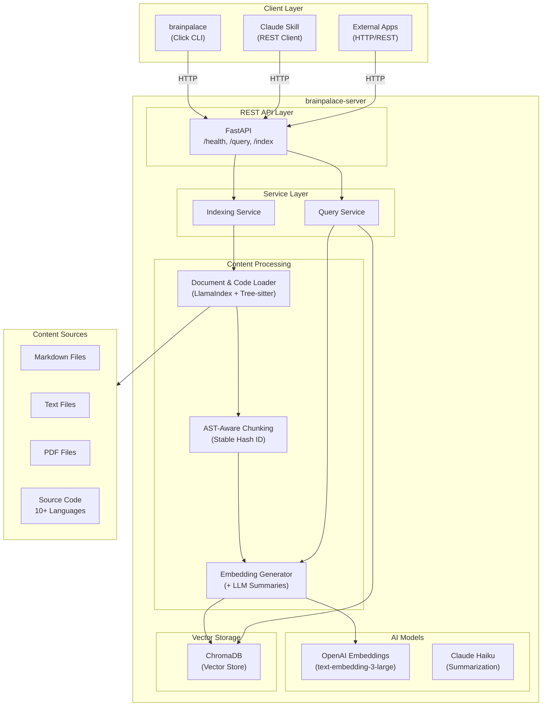

# BrainPalace Developer Guide

This guide covers setting up a development environment, understanding the architecture, and contributing to BrainPalace.

## Table of Contents

- [Architecture Overview](#architecture-overview)
- [Monorepo Structure](#monorepo-structure)
- [Quick Start for Developers](#quick-start-for-developers)
- [Task Commands](#task-commands)
- [Testing](#testing)
- [Troubleshooting](#troubleshooting)
- [Multi-Instance Architecture](#multi-instance-architecture)
- [Code Ingestion & Language Support](#code-ingestion-language-support)

---

## Architecture Overview

BrainPalace is a RAG (Retrieval-Augmented Generation) system for semantic search across documentation and source code.



---

## Monorepo Structure

| Package | Directory | Description |
|---------|-----------|-------------|
| `brainpalace-server` | `brainpalace-server/` | FastAPI REST API backend |
| `brainpalace-cli` | `brainpalace-cli/` | Click-based CLI management tool |
| `brainpalace-skill` | `brainpalace-skill/` | Claude Code skill definition |
| `e2e` | `e2e/` | End-to-end integration tests |

### Notable sub-modules

| Module | Path | Description |
|---|---|---|
| `brainpalace_cli.mcp_server` | `brainpalace-cli/brainpalace_cli/mcp_server/` | Opt-in stdio MCP shim invoked as `brainpalace mcp`. Thin wrapper over `DocServeClient` + `discovery.py` exposing 9 tools (`query`, `status`, `whoami`, `folders_list`, `jobs_list`, `recall`, `session_context`, `ai_guide` are read-only; `memorize` writes a curated memory) to MCP-aware AI clients. Tests at `brainpalace-cli/tests/mcp_server/`. **Named `mcp_server`, not `mcp`** — the original `mcp` name collided with the SDK's top-level `mcp` package under `coverage --cov=brainpalace_cli` instrumentation, so renaming the sub-package was the surgical fix. CLI subcommand `mcp` (user-facing) is unchanged. |

---

## Quick Start for Developers

### Prerequisites
- **Python 3.10+**
- **Poetry** - `pip install poetry`
- **Task** - `brew install go-task/tap/go-task`
- **OpenAI & Anthropic API keys**

### Installation
```bash
git clone git@github.com:bxw91/brainpalace.git
cd brainpalace
task install
```

### Global CLI Setup (Recommended)
```bash
task install:global
```
This installs `brainpalace-serve` and `brainpalace` in your current Python environment's bin folder, allowing you to run them from any directory.

---

## Task Commands

The root `Taskfile.yml` orchestrates the entire monorepo.

| Command | Description |
|---------|-------------|
| `task install` | Install all dependencies |
| `task install:global` | Install tools as global CLI commands |
| `task dev` | Start server in development mode |
| `task pr-qa-gate` | **MANDATORY** before push: Run all quality checks |
| `task test` | Run all tests |
| `task eval` | Run the retrieval eval harness (directional, **not** a gate) |
| `task status` | Wrapper for `brainpalace status` |

---

## Testing

### Running the QA Gate
Before pushing any changes, you MUST run:
```bash
task pr-qa-gate
```
This ensures:
1. Linting (Ruff) passes.
2. Type checking (mypy) passes.
3. Unit and Integration tests pass.
4. Test coverage is above 50%.

> **The local gate is necessary, not sufficient.** CI (and the release publish
> workflow) re-run the suite in a *pristine env with no Claude Code plugin
> installed* and may resolve a different Click version. A test that passes
> locally can still fail there — see "Interactive CLI tests must be
> host-independent" below.

### Interactive CLI tests must be host-independent
Tests that drive `brainpalace init` / `config wizard` with a canned stdin string
(`CliRunner(..., input=...)`) are a recurring source of pass-locally/fail-CI
breaks. Two host-dependent behaviors bite:

- **Claude Code plugin presence.** `claude_plugin_installed()` changes the
  wizard/init wording and which prompts appear. A dev box running inside Claude
  Code reports the plugin present; CI does not. **Mock it** (e.g.
  `patch("brainpalace_cli.commands.config.claude_plugin_installed",
  return_value=False)`) so the prompt sequence is fixed.
- **Exhausted-stdin behavior.** When the input runs out, some Click versions
  return each prompt's *default* (so the wizard completes) while others **abort**
  (`SystemExit`). Never rely on this. **Answer every prompt explicitly** — count
  the prompts in the command and supply one line each, including any sub-prompts
  and the final `Proceed?`/continue gate. When you add a prompt, realign *all*
  interactive tests' stdin in the same change.

Also mock the network port scan (`_find_available_api_port`) so the wizard
doesn't probe real sockets under test. A test that follows these rules behaves
the same on every host and in CI.

### Documentation Freshness (`last_validated`)
Freshness has two parts:
- `last_validated: YYYY-MM-DD` in each audited doc's frontmatter — human-readable
  **"this doc was last read against the live code and confirmed accurate on that
  date"**. Display only; *not* an auto "last modified" stamp, and it does **not**
  gate.
- A **content hash** of the doc's **authored content** (prose + non-contract
  frontmatter, with machine-owned `GENERATED` blocks and metadata stripped),
  recorded in the sidecar manifest **`scripts/doc_freshness.json`** (a committed
  `path → sha256` map). This is the value the gate actually compares. It lives in
  the manifest, *not* in frontmatter, so docs render clean on GitHub.

The rule:

> **When you change an audited doc's content, you must re-confirm it against the
> code and re-stamp it.** A doc whose authored content no longer matches its
> manifest hash is *stale* — the claim of validation no longer covers the current
> text.

Why a hash and not a date: a date comparison is blind below day granularity, so
an edit made the *same calendar day* as validation slipped through. The hash
compares *what the content is*, not *when it changed*, so same-day edits are
caught. Machine-owned regions are excluded, so a pure doc-sync regen does not
trip the gate.

Enforcement is automated. `task lint:doc-freshness` (run as part of
`task before-push`) fails if any audited doc's authored content differs from its
manifest hash, or has no manifest entry. The audited set is the same globs used
by the audit scripts: `docs/*.md`, `brainpalace-plugin/commands/*.md`,
`brainpalace-plugin/skills/*/SKILL.md`, `brainpalace-plugin/skills/*/references/*.md`,
`brainpalace-plugin/agents/*.md`, plus the standalone files `README.md`,
`CLAUDE.md`, `AGENTS.md`, and `brainpalace-plugin/README.md`. The generated
`skills/using-brainpalace/SKILL.md` is removed via `FRESHNESS_EXEMPT` (single-sourced
from `PLUGIN_DOC_GATE_EXEMPT`) — it is emitted from `ai_guidance.md` and gated by
`lint:ai-guidance-parity`, so it must not be double-gated here.

**Generated provider/install tables.** Provider tables (models + API-key env var
per provider) and the runtime install-dir table are machine-owned `<!--GENERATED-->`
blocks rendered from the LIVE registries — `brainpalace_cli.providers.PROVIDERS`
and `install_agent.INSTALL_DIRS`. Change the registry in code, run
`brainpalace sync-docs --fix`, and every block regenerates; `lint:doc-sync`
(`ProviderTablesChecker`) fails if a block drifts. Block names: `providers-embedding`,
`providers-summarization`, `providers-reranker`, `install-dirs`. To put a table
under code control, drop the empty markers where it belongs and run `--fix`. Note:
**only tables whose content equals the registry** (provider/env/models) should be
generated — richer curated tables (e.g. the cost/dimension table in
`docs/PROVIDER_CONFIGURATION.md`) carry facts not in the registry and stay
human-authored + freshness-gated.

This manifest doubles as the **registry for the `lint:doc-sync` plugin-docs
gate** (`PluginDocsChecker`): that gate folder-scans `agents/*.md`,
`skills/*/SKILL.md`, `skills/*/references/*.md`, and the plugin `README.md` for
dangling command/skill references, and **fails closed** on any scanned doc that
is neither in this manifest nor in `PLUGIN_DOC_GATE_EXEMPT`. Because both the gate
and the freshness scripts glob those folders, a brand-new agent, reference, **or
skill** is covered automatically: the normal `add_audit_metadata.py` stamp
registers it — no manual file-list edit. The only manual step is for a doc that
must *not* be gated (rare): add it to `PLUGIN_DOC_GATE_EXEMPT` with a reason.

To clear staleness after actually re-reading the docs:
```bash
python scripts/check_doc_freshness.py        # list what's stale
python scripts/add_audit_metadata.py         # re-stamp last_validated (today) + manifest hash
```
Do **not** run `add_audit_metadata.py` to silence the check without re-reading
the doc — the stamp asserts a human (or you) verified it against the code.
(`--keep-date` re-records only the manifest hash, preserving the existing date;
use it for mechanical backfills, not to claim fresh validation.)

### Changelog style (`docs/CHANGELOG.md`)
Changelog entries are for **readers deciding whether a change affects them**, not
for explaining how it was built. Keep each entry **short**:

> **Each entry is ≤ 3 sentences and ≤ 320 characters.** A bold lead naming what
> changed, one sentence of user-facing impact, and at most one clause for the key
> default/gotcha or the cross-surface parity pointer. Reference the issue/PR
> (`(#NN)`) and let the **commit message** carry the root-cause / file-level
> detail — don't duplicate it here.

The 320-char cap is a backstop against run-ons that pack many clauses into one
period-terminated sentence (joined with `;`/`—`) to dodge the sentence count.
The caps apply to **every** entry, old and new — released sections may be
normalized for length in a deliberate pass, but never drop a real entry, version
header, date, or issue reference when tightening. Group entries under the standard
Keep-a-Changelog headings (`Added`, `Changed`, `Fixed`, `Docs`, …) within each
`[YY.M.N]` section.

Enforcement is automated. `task lint:changelog` (run as part of `task
before-push`) fails when any **`[Unreleased]`** or **most recent released** entry
exceeds the 3-sentence cap, or any **`[Unreleased]`** entry exceeds 320 chars
(the char cap is authoring-time only — entries land in `[Unreleased]` first — so
already-versioned sections are never failed retroactively). Older sections are
out of scope for both. The check (`scripts/check_changelog_style.py`) strips
inline code, link targets, and CalVer dots before counting, so only real sentence
terminators count.

### Test Directories
- `brainpalace-server/tests/`: Server-specific tests.
- `brainpalace-cli/tests/`: CLI-specific tests.
- `e2e/`: Full workflow integration tests.

### End-to-End Validation Script

Before releasing any version or merging major features, you MUST run the end-to-end validation script:

```bash
./scripts/quick_start_guide.sh
```

This script validates the complete BrainPalace workflow by:
1. Starting a real server instance
2. Indexing the project codebase (code included by default)
3. Running semantic, BM25, and hybrid search queries
4. Testing summarization features
5. Verifying proper error handling and cleanup

**Requirements:**
- `OPENAI_API_KEY` environment variable set
- Poetry and lsof installed
- Server and CLI dependencies installed

**Exit Codes:**
- `0`: All tests passed
- Non-zero: Test failures or setup issues

The script serves as both a release validation tool and a comprehensive demonstration of BrainPalace's capabilities.

### Retrieval Evaluation Harness

When you change anything that affects **retrieval quality** (indexing, chunking,
embeddings, fusion, reranking, graph), measure it instead of guessing:

```bash
task eval                 # recall@k + MRR per mode, diffed vs a committed baseline
```

This is **directional, not pass/fail**, and deliberately **not** part of
`pr-qa-gate` (scores are noisy and provider-dependent). It builds a throwaway
index over a small committed corpus, runs a query set, and flags any metric or
case that regressed against `tests/eval/baseline.json`. Needs `OPENAI_API_KEY`.
Full guide: [EVALUATION.md](EVALUATION.md).

---

## Troubleshooting

### ModuleNotFoundError: No module named 'src'
This usually means you are running the tool without installing it or the `PYTHONPATH` is not set.
**Solution**: Run `task install:global` or always use `poetry run`.

### Port 8000 Already in Use
**Solution**: `lsof -ti :8000 | xargs kill -9`

### Duplicated Results in Query
**Solution**: The system uses stable IDs based on file path and chunk index. If you see duplicates, run `brainpalace reset --yes` to clear the old index and re-index.

---

## Multi-Instance Architecture

BrainPalace supports running multiple concurrent instances with per-project isolation. This enables developers to work on multiple projects simultaneously without port conflicts or index cross-contamination.

### State Directory Structure

Each project stores its state in `.brainpalace/`:

```
<project-root>/
└── .brainpalace/
    ├── config.json      # Project configuration (optional, can be committed)
    ├── runtime.json     # Runtime state (DO NOT commit - add to .gitignore)
    ├── doc-serve.lock   # Lock file for preventing double-start
    ├── doc-serve.pid    # Process ID file
    ├── data/            # ChromaDB and index data
    └── logs/            # Server logs
```

### Runtime State Format

The `runtime.json` file contains:

```json
{
  "mode": "project",
  "port": 49321,
  "base_url": "http://127.0.0.1:49321",
  "pid": 12345,
  "instance_id": "abc123def456",
  "project_id": "my-project",
  "started_at": "2026-01-27T10:30:00Z"
}
```

### Lock File Protocol

The lock file prevents concurrent startup:

1. Server attempts exclusive lock on `doc-serve.lock`
2. If lock fails, another instance is starting/running
3. Lock released on graceful shutdown
4. Stale locks detected via PID validation

### Project Root Resolution

Project root is determined in this order:

1. **Git repository root**: `git rev-parse --show-toplevel`
2. **Marker files**: Directory containing `.brainpalace/`, `pyproject.toml`, `package.json`, `Cargo.toml`, etc.
3. **Current directory**: Fallback if no markers found

Symlinks are resolved to canonical paths to ensure consistent state directories.

### Configuration Precedence

Settings are resolved in order (first wins):

1. Command-line flags (`--port 8080`)
2. Environment variables (`DOC_SERVE_STATE_DIR`, `DOC_SERVE_MODE`, kill-switches)
3. Project config (`.brainpalace/config.yaml`)
4. Global config (`~/.config/brainpalace/config.yaml`, XDG)
5. Built-in (pydantic) defaults

**`config.yaml` is resolved per key as `code < global < project`** (env on top).
The server merges the global XDG `config.yaml` *under* the project file
(`provider_config.load_merged_config_dict` / `load_raw_config`): a key the project
omits is inherited from global, then the code default. Every block loader
(provider, git, session, indexing, bm25, query-log) reads this merged dict.

The project `config.yaml` is therefore **sparse** — it stores only values that
diverge from the inherited one:

- `brainpalace init` writes only explicit flags / divergent interactive answers;
  prompts default to the global value and accepting it writes nothing (inherits).
  With **no** global config, init seeds env-detected code defaults so the project
  stands alone.
- `brainpalace config unset <dotpath>` (and the dashboard's per-field **unset**
  control) removes a project override so the key inherits again. The dashboard
  shows a provenance badge (project/global/code) and, for project-set keys, the
  value it would fall back to if unset (`ConfigService.effective().inherited`).

Do **not** reintroduce verbatim "copy the global into the project" writes — that
breaks inheritance (a later global edit would no longer propagate).

> `config.json` (server `bind_host`/ports, runtime-managed) is **not** layered;
> only `config.yaml` participates in `code < global < project` resolution.

### Dashboard's own config (`dashboard.yaml`)

The control-plane dashboard's **own** settings (host/port/poll/token/autostart/
display formats) live in their own file, `~/.config/brainpalace/dashboard.yaml`
— **not** the `dashboard:` block of `config.yaml`. On first load the loader
auto-migrates a legacy `config.yaml` `dashboard:` block into `dashboard.yaml`
and strips it (other `config.yaml` sections survive). The file is **single-scope**
(`file` > code `default`, no global/project layering) and **sparse**: a field
equal to its `DashboardConfig` default is never persisted, and an unset deletes
the key so the code default applies. The dashboard route `settings/effective`
(per-field `{value, source}`, token masked) powers the Settings tab's inline
inherit-first control (`using code default: X` + the choices/input); the revert
is staged in the draft and applied as the Save `unset` list, not an immediate call.

### Health Endpoint Enhancement

The `/health` endpoint now includes mode information:

```json
{
  "status": "healthy",
  "mode": "project",
  "instance_id": "abc123def456",
  "project_id": "my-project"
}
```

---

## Setup-surface parity (CLI · plugin · MCP)

BrainPalace exposes the **same install / configuration / setup behavior through
three independent front-ends**. They are separate code and docs, and they drift
apart silently — a change to one is **not** picked up by the others.

| Surface | Where it lives |
|---------|----------------|
| **CLI / bash** | `scripts/setup.sh` (guided), `scripts/install.sh`, and the `brainpalace init` / `config wizard` commands under `brainpalace-cli/` |
| **Claude plugin** | `brainpalace-plugin/commands/brainpalace-{setup,config,install,install-agent}.md`, `brainpalace-plugin/agents/setup-assistant.md`, `brainpalace-plugin/skills/configuring-brainpalace/**` |
| **MCP** | the `brainpalace mcp` entrypoint, the MCP client-config templates (duplicated in `scripts/setup.sh` and the plugin setup command), and `docs/MCP_SETUP.md` |

**Rule:** when you change install / configuration / setup behavior in **one**
surface, update the other two **in the same change** and record it in
`docs/CHANGELOG.md`. Behavior that must stay aligned includes: the config-file
location written (canonical = XDG `~/.config/brainpalace/config.yaml`), the
provider/wizard flow, whether project init is optional, the MCP client
templates, and the documented config search order.

**Parity checklist** — run through it for any setup-feature change:

- [ ] **CLI:** `scripts/setup.sh` + `scripts/install.sh` reflect the change.
- [ ] **Plugin:** `/brainpalace-setup`, `/brainpalace-config`, the
      `setup-assistant` agent, and the `configuring-brainpalace` references
      reflect it; bump each edited doc's `last_validated`.
- [ ] **MCP:** client templates + `docs/MCP_SETUP.md` reflect it.
- [ ] Config search order / write target matches the server resolver
      (`brainpalace-server/brainpalace_server/config/provider_config.py`) across
      every doc that lists it (XDG preferred, legacy `~/.brainpalace/` deprecated).
- [ ] `docs/CHANGELOG.md` `[Unreleased]` notes the change.

> **Why this section exists:** the CLI went global-first (XDG) while the plugin
> kept writing the deprecated `~/.brainpalace/` path, so the plugin's config was
> silently ignored whenever both were installed. This rule prevents a repeat.

---

## Dashboard parity — surface every feature

The control-plane dashboard (`brainpalace-dashboard/`) is meant to surface
**every** config option, CLI command, and project-server endpoint. Without
enforcement these drift: a new endpoint or command ships and the dashboard
never grows a control for it. The parity gate prevents that.

### CLI ↔ dashboard import boundary (the dashboard is optional)

The dashboard package (`brainpalace-dashboard`, `python = ">=3.12"`) is **not
installed** in the publish/PR-QA CLI quality gate (Python 3.11). So **CLI code
must never `import brainpalace_dashboard` in a call/render path** — probe it
through `brainpalace_cli.commands._dashboard_url.dashboard_status_info()`, which
returns `{"status": "not_installed"}` when the package is absent. A direct import
passes locally (where the dashboard usually IS installed) and then fails the
dashboard-absent CI gate.

Same trap in **tests**: a CLI test asserting dashboard-aware output must mock
`dashboard_status_info` (or another seam that doesn't import the package) — never
assume `import brainpalace_dashboard` succeeds. `task release:rehearse-ci` runs
the cli/server suites with the package import-blocked (`BRAINPALACE_BLOCK_DASHBOARD`),
so this class now fails in `before-push` instead of in CI.

**The gate:** `tests/test_dashboard_parity.py`, run via
`task lint:dashboard-parity` (included in `task before-push`). It imports the
**live** sources of truth — not snapshots — and diffs them against the
checked-in coverage maps:

| Check | Live source | Allowlist (with reasons) | What "satisfied" means |
|-------|-------------|--------------------------|------------------------|
| **Config** | the server **pydantic config models** (`model_introspect.SECTION_MODELS`), plus config_schema for the model-less api/server/project sections | `ui_schema.DASHBOARD_HIDDEN_FIELDS` | Every model field is rendered by `ui_schema.build_ui_schema()` **or** hidden with a reason; its widget/default/enum are **derived from the model** (no hand table to drift). Config fields auto-render, so usually nothing to do. |
| **CLI** | `brainpalace_cli.cli.cli.commands` (Click group) | `coverage_maps.CLI_DASHBOARD_COVERAGE` | Every registered command maps to a dashboard tab/action **or** a `cli_only: <reason>` entry; no map entry for a removed command. |
| **Endpoint** | `brainpalace_server.api.main.app.routes` (dashboard route prefixes) | `coverage_maps.ENDPOINT_SURFACES` | Every live `route.path` maps to a tab **or** an `unsurfaced: <reason>` entry; no map entry for a removed route. Keys match the exact FastAPI `route.path` (`{param}` form; data ops are nested under `/index/`). |

**The coverage maps** live in
`brainpalace-dashboard/brainpalace_dashboard/coverage_maps.py`
(`CLI_DASHBOARD_COVERAGE`, `ENDPOINT_SURFACES`, plus a re-export of
`DASHBOARD_HIDDEN_FIELDS`). They are the only checked-in snapshots; every entry
that is not surfaced in the UI carries a one-line reason.

**To satisfy the gate when you add something:**

- [ ] **New config field** → add it to its server pydantic model; it then
      auto-renders with a widget/default/options **derived from the model**. Only
      touch `ui_schema.py` to add a presentation `OVERRIDE` (label/help/
      visibility), or `DASHBOARD_HIDDEN_FIELDS` (with a reason) if it must not be
      shown. `OVERRIDES` must stay presentation-only — never put `widget`/
      `default`/`options` there (a gate enforces this). A whole new **section**
      needs its model added to `model_introspect.SECTION_MODELS` + an entry in
      `ui_schema.SECTION_ORDER`.
- [ ] **New CLI command** → add a `CLI_DASHBOARD_COVERAGE` entry: the tab/action
      it maps to, or `cli_only: <reason>`.
- [ ] **New / changed server endpoint** → add the exact live `route.path` to
      `ENDPOINT_SURFACES`: the tab it maps to, or `unsurfaced: <reason>`. Remove
      any map key for a route you deleted/renamed.
- [ ] Build the dashboard control for anything user-facing, in the same change.
- [ ] `docs/CHANGELOG.md` `[Unreleased]` notes it.
- [ ] `task lint:dashboard-parity` green.

> **Why this section exists:** the dashboard's whole point is to be the single
> management surface; an un-enforced "remember to add it to the UI" rule rots
> immediately. The gate makes drift a failing test, not a silent gap.

---

## AI-guidance parity — single source

AI-facing usage guidance (how an AI should search this codebase: modes, query
rules, the `--json` contract, server-down behavior) used to be hand-copied across
three surfaces that drifted silently. It now flows from **one source**.

**The source:** `brainpalace-cli/brainpalace_cli/data/ai_guidance.md`, with three
nested, marker-delimited tiers — **NUDGE ⊂ CORE ⊂ FULL**:

| Tier | Bytes (approx) | Consumer | Why this size |
|------|----------------|----------|---------------|
| **NUDGE** | ~580 | SessionStart hook `additionalContext` | Plugin users already load FULL via the skill; the hook only nudges. |
| **CORE** | ~4.2 K | MCP `Server(instructions=...)` | MCP clients have no skill/hook — they need the whole decision contract at connect. |
| **FULL** | ~7.7 K | generated SKILL.md, `ai-guide --tier full`, `ai_guide` MCP tool | The complete guide; pulled on demand. |

CORE is a literal slice of FULL; NUDGE a literal slice of CORE — never
hand-maintained copies. The loader/renderer is `brainpalace_cli/ai_guidance.py`;
`brainpalace ai-guide --tier <t> --format <f>` renders it. `version` /
`last_validated` come from the source's `meta:` line (never `today()`), so output
is byte-deterministic.

**Surfaces & how they consume the source:**

| Surface | Mechanism | Notes |
|---------|-----------|-------|
| Plugin skill | `SKILL.md` is GENERATED (`--format skill`) | Never hand-edit. Skill-only frontmatter lives in `ai_guidance.py`'s template. |
| MCP instructions | `Server(instructions=core())` at connect | Fail-soft: empty source → no instructions. |
| MCP `ai_guide` tool | read-only tool returning a tier | The ONLY pull path for MCP-only clients (CLI `ai-guide` is unreachable over MCP). |
| SessionStart hook | thin shim → `brainpalace hook sessionstart` | All logic CLI-side; legacy fat hooks auto-migrate on `brainpalace start`. |
| CLI query footer | one-line hint on interactive `query` runs | Pull path for CLI-only external agents; TTY + non-`--json` only, disable via `cli.show_ai_hint: false` or `BRAINPALACE_NO_AI_HINT`. |

**The gate:** `scripts/check_ai_guidance_parity.py`, run via
`task lint:ai-guidance-parity` (in `task before-push`). It imports the **live**
renderer and fails on: SKILL.md ≠ generated; an empty NUDGE/CORE slice (catches
stray marker tokens in the header comment); the two in-repo hook copies differing
or carrying legacy fat-hook logic; the MCP `Server(instructions=...)` not equal to
the CORE tier verbatim; non-English **letters** in NUDGE/FULL (Unicode
punctuation like `—` `…` `⊂` is allowed; accented/Cyrillic letters fail).

**To satisfy the gate when you change guidance:**

- [ ] Edit `data/ai_guidance.md` **only** (verify any contract claim against LIVE
      code — Click group, `QueryRequest`, FastAPI routes — never against another doc).
- [ ] Regenerate the skill:
      `cd brainpalace-cli && poetry run brainpalace ai-guide --format skill > ../brainpalace-plugin/skills/using-brainpalace/SKILL.md`.
- [ ] Keep it English-only (AI guidance + user-facing CLI strings).
- [ ] Never write literal tier-marker tokens inside the source's header comment.
- [ ] Bump the source `meta:` `last_validated` (and `version` if structural).
- [ ] `docs/CHANGELOG.md` `[Unreleased]` notes it.
- [ ] `task lint:ai-guidance-parity` green.

> **Why this section exists:** three independent front-ends (plugin/MCP/hook) for
> the same instructions drift the instant one is edited. One source + a generated
> skill + a parity gate makes drift a failing test, not a silent gap.

---

## Code Ingestion & Language Support

BrainPalace supports AST-aware code chunking for 10 programming languages using tree-sitter. The current implementation includes: **Python, TypeScript, JavaScript, Java, Go, Rust, C, C++, C#, and Object Pascal**. (Kotlin and Swift are also detected and indexed, but chunked without AST metadata.)

Adding support for new programming languages is straightforward:

### Recommended Package: tree-sitter-language-pack

Use [`tree-sitter-language-pack`](https://pypi.org/project/tree-sitter-language-pack/) - a maintained fork with 160+ pre-built language grammars.

**Advantages:**
- Pre-compiled binaries (no C compiler needed)
- 160+ languages in a single dependency
- Permissive licensing (no GPL dependencies)
- Aligned with tree-sitter 0.25.x

**Installation:**
```bash
pip install tree-sitter-language-pack
```

### Simple API

```python
from tree_sitter_language_pack import get_language, get_parser

# Get parser for any supported language
parser = get_parser('rust')
language = get_language('rust')

# Parse code
tree = parser.parse(b"fn main() { println!(\"Hello\"); }")
```

### Step-by-Step: Adding a New Language

**Step 1: Verify language support**
```python
from tree_sitter_language_pack import get_language

try:
    lang = get_language('ruby')
    print("Ruby is supported!")
except Exception:
    print("Ruby not available")
```

**Step 2: Update extension mapping**

In `brainpalace_server/indexing/document_loader.py`:

```python
# Add to CODE_EXTENSIONS
CODE_EXTENSIONS: set[str] = {
    ".py", ".ts", ".tsx", ".js", ".jsx",
    ".rb",  # NEW: Ruby
}

# Add to EXTENSION_TO_LANGUAGE
EXTENSION_TO_LANGUAGE = {
    # ... existing mappings ...
    ".rb": "ruby",
}
```

**Step 3: Register the tree-sitter grammar in CodeChunker**

In `brainpalace_server/indexing/chunking.py`, add the language to the `lang_map`
in `CodeChunker._setup_language()` so AST-aware chunking picks it up (a language
not in this map is still indexed, but chunked without AST metadata):

```python
def _setup_language(self) -> None:
    lang_map = {
        "python": "python",
        "typescript": "typescript",
        # ... existing mappings ...
        "ruby": "ruby",  # NEW
    }
```

**Step 4: Tune chunk sizing (optional)**

`CodeChunker` takes per-instance `chunk_lines`, `chunk_lines_overlap`, and
`max_chars` arguments (defaults: 40 / 15 / 1500). Pass language-appropriate
values when constructing it for a verbose or terse grammar — there is no global
per-language config table.

### C# Language Support

C# is fully supported with AST-aware parsing:

**File Extensions:**
- `.cs` - C# source files
- `.csx` - C# script files

**Extracted Symbols:**
- Classes, interfaces, structs, records, enums
- Methods, properties, fields
- Parameters and return types
- Namespaces

**XML Documentation:**
BrainPalace extracts XML doc comments (`/// <summary>`, `/// <param>`, `/// <returns>`) and stores them as metadata on chunks.

**Tree-sitter Grammar:**
Uses the `c_sharp` grammar from `tree-sitter-language-pack`.

**Content Detection Patterns:**
- `using System;`
- `namespace` declarations
- Property accessors `{ get; set; }`
- Attributes `[AttributeName]`

### Available Languages (160+)

| Category | Languages |
|----------|-----------|
| Systems | C, C++, Rust, Go, Zig |
| JVM | Java, Kotlin, Scala, Groovy |
| .NET | C#, F# |
| Scripting | Python, Ruby, Perl, Lua, PHP |
| Web | JavaScript, TypeScript, HTML, CSS |
| Functional | Haskell, OCaml, Elixir, Erlang, Clojure |
| Data | SQL, JSON, YAML, TOML, XML |
| Config | Dockerfile, Terraform (HCL), Nix |
| Shell | Bash, Fish, PowerShell |
| Scientific | R, Julia, Fortran |
| Mobile | Swift, Objective-C |

### Alternative: Individual Packages

For minimal dependencies, use individual tree-sitter packages:

```bash
pip install tree-sitter-python tree-sitter-javascript
```

```python
import tree_sitter_python as tspython
from tree_sitter import Language, Parser

PY_LANGUAGE = Language(tspython.language())
parser = Parser(PY_LANGUAGE)
```

### Alternative: tree-sitter-languages

The original [`tree-sitter-languages`](https://pypi.org/project/tree-sitter-languages/) package (40+ languages):

```bash
pip install tree-sitter-languages
```

```python
from tree_sitter_languages import get_language, get_parser

language = get_language('python')
parser = get_parser('python')
```

### References

- [tree-sitter-language-pack on PyPI](https://pypi.org/project/tree-sitter-language-pack/)
- [tree-sitter-languages on PyPI](https://pypi.org/project/tree-sitter-languages/)
- [tree-sitter-languages GitHub](https://github.com/grantjenks/py-tree-sitter-languages)
- [Tree-sitter Documentation](https://tree-sitter.github.io)
